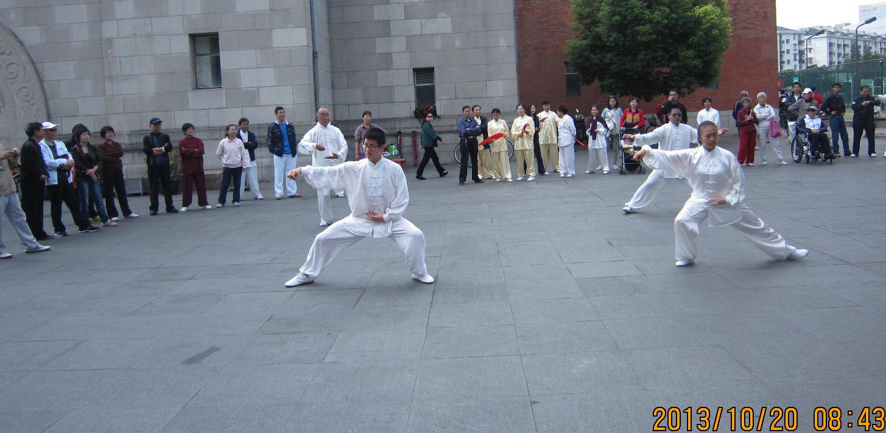



  <h1>江湾太极</h1>
  <h2>马殿银老师弟子和学员介绍</h2>

	

	    <h4><i class="icon_wallet"></i>李昌振个人介绍</h4>
	    
李昌振，1982年生，籍贯山东省德州市，从事IT行业。爱好跑步和武术，曾短暂学习过梅花桩、散打、跆拳道等，2010年跟从马殿银老师学习陈氏太极拳新架，获得成绩如下：
	     &nbsp;&nbsp;&nbsp;&nbsp;&nbsp;&nbsp; * 上海市陈式太极拳协会30周年交流比赛，男子套路一等奖(2013)。
	     &nbsp;&nbsp;&nbsp;&nbsp;&nbsp;&nbsp; * 全国武术太极拳公开赛，男子青年组套路二等奖(2014)。
	    

    

    

     <h4><i class="icon_wallet"></i>其它资料链接</h4>
     
<a href="http://www.taijiren.cn/details/19327.html">太极传承网收录资料</a>
   

   

     <h4><i class="icon_wallet"></i>个人拳照</h4>
     
   

   

