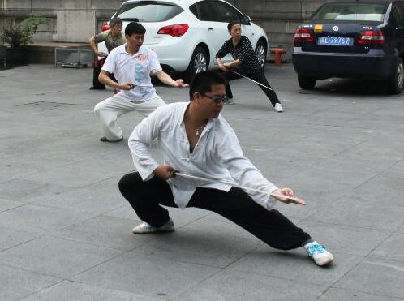



  <h1>江湾太极</h1>
  <h2>马殿银老师弟子和学员介绍</h2>

  <ul class="wp">
    <li class="r"><a href="/categories.html">太极拳文章</a></li>
    <li class="r"><a href="/index.html"></i>首页</a></li> 
  </ul>

 

	

	    <h4><i class="icon_wallet"></i>翁志刚个人介绍</h4>
	    
翁志刚，1975年生，籍贯浙江省宁波市，从事教育培训行业。从小爱好武术，曾经练习过长拳。2012年跟随马殿银老师学习陈式太极拳、剑。获得成绩如下：
       &nbsp;&nbsp;&nbsp;&nbsp;&nbsp;&nbsp; * 上海市陈式太极拳协会30周年交流比赛，男子套路一等奖（2013）。	   
      

    

   

     <h4><i class="icon_wallet"></i>个人拳照</h4>
     
   

   

